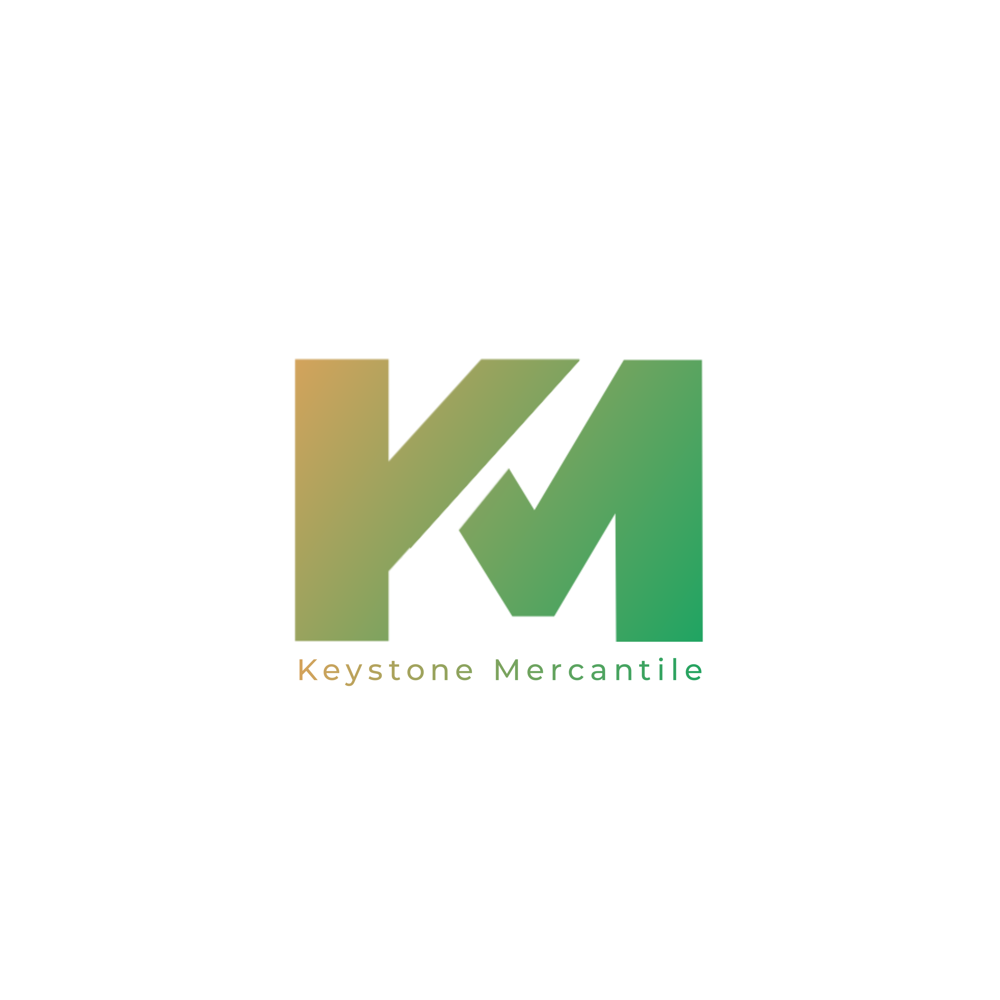

<p align="center">
  
</p>

<h1 align="center">🌿 Keystone Mercantile Limited</h1>

<p align="center">
  <strong>Exporting Africa's Finest Agricultural Commodities to the World.</strong>
</p>

<p align="center">
  
  
  
  
  
  
</p>

---

## 📖 About Keystone Mercantile
Keystone Mercantile Limited is a large-scale exporter of premium African foods, spices, and fresh agricultural commodities. Based in **Ijebu Ode, Ogun State, Nigeria**, the company services a loyal global buyer base with exports shipping regularly to major ports in **India, China, Vietnam, Taiwan, Australia, Canada**, and neighboring African nations.

This website serves as the official corporate landing page, showcasing their extensive product catalog, operational standards, quality control policies, and direct communication channels.

---

## ✨ Key Features

*   **🎬 Dynamic Intro Preloader:** A high-end loading overlay featuring the centered gold-glow logo, staggered lettering entrance, and gold progress bar that transitions via a smooth dissolve.
*   **📦 Products Catalog with Pagination:** Showcases 20 organic commodities (Cashews, Cocoa, Bitter Kola, Spices, Hardwood Charcoal, etc.) with a smart "Load More" pagination that shrinks back to 5 items via a smooth "Load Less" container scroll.
*   **💬 Integrated WhatsApp Forms:** An interactive query form that compiles visitors' details into clean, professional, asterisk-free WhatsApp chat threads redirecting directly to `8067540693`.
*   **🗺️ Google Maps Pinpointing:** Clicking on the corporate address dynamically opens Google Maps targeting precise GPS coordinates (`6.8208, 3.9208`) with street-level zoom (`17z`) to drop an exact pinpoint marker.
*   **❓ Animated FAQ Accordions:** Built-in FAQs answering sourcing, packing, shipping, and logistic standards with clean toggle micro-animations.
*   **📱 Mobile First & Responsive:** Tailwind grid layouts optimized for flawless rendering on all screens (mobile, tablets, and desktops) with horizontal scroll containment.

---

## 🛠️ Technology Stack
*   **Build Tool:** Vite
*   **Language:** React + TypeScript (Strict Type Safety)
*   **Styling:** Tailwind CSS + Vanilla CSS Tokens
*   **Animations:** GSAP (GreenSock) + Native IntersectionObserver
*   **Icons:** Lucide React

---

## 📂 Project Directory Structure

```text
├── app/
│   ├── public/
│   │   └── images/          # Product assets, background farm images, and logos
│   ├── src/
│   │   ├── components/      # Common components (Preloader, Back to Top button)
│   │   ├── sections/        # Section components (Hero, About, Products, Faq, Contact, etc.)
│   │   ├── App.tsx          # Main layout and ScrollTrigger lifecycle
│   │   ├── index.css        # Base styling rules and global containment
│   │   └── main.tsx         # Mounting bundle entrypoint
│   ├── index.html           # Document base, font preloads, and SEO/OG metatags
│   └── package.json         # Scripts, workspace modules, and dependencies
└── Keystone Agribiz Profile.pdf  # Corporate documentation
```

---

## 🚀 Local Installation & Setup

To run this project locally, ensure you have **Node.js** installed, then execute:

1. **Navigate into the application folder:**
   ```bash
   cd app
   ```

2. **Install dependency packages:**
   ```bash
   npm install
   ```

3. **Launch the development server:**
   ```bash
   npm run dev
   ```
   *The local server will start, typically running at `http://localhost:3000/`.*

4. **Compile production-ready bundles:**
   ```bash
   npm run build
   ```
   *Vite will bundle and compile optimized files into the `dist/` directory.*

---

## 💻 Developer Credits
Developed and designed with premium web standards by **Bobmatrix**.
